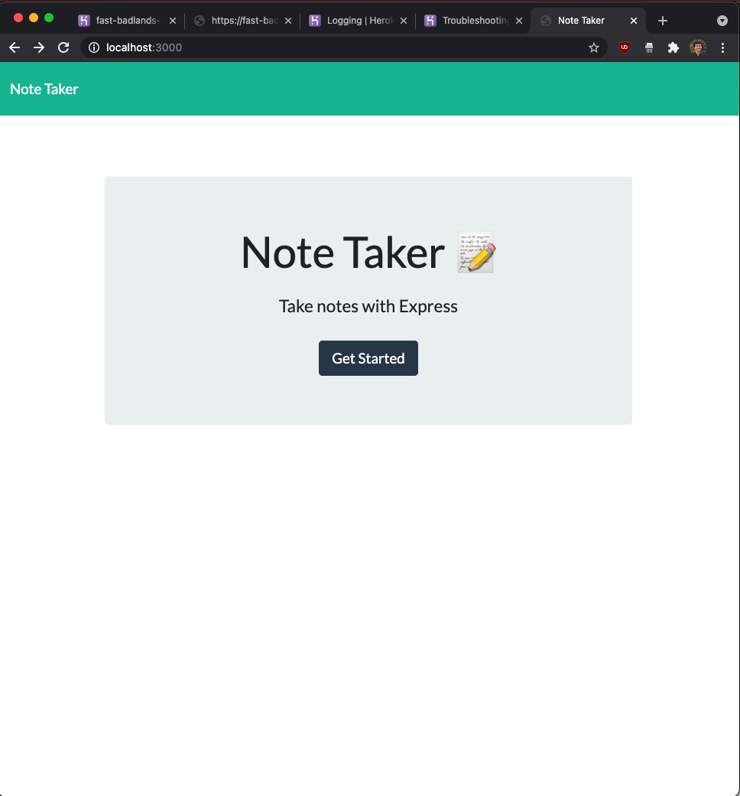
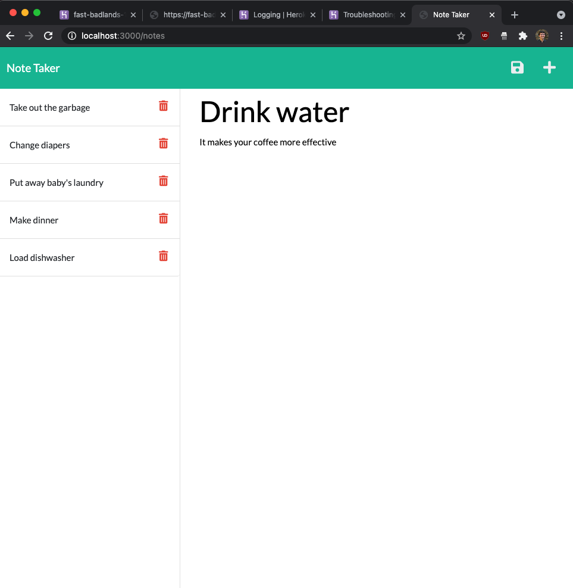

# Note Taker

## Table of Contents

*[Description](#description)

*[Installation](#installation)

*[Usage](#usage)

*[License](#license)

*[Contributing](#contributing)

*[Tests](#tests)

*[Questions](#questions)

## Description

This app will allow you to make type in a note's title and some more details. It will then store the note for you on the server which you then can access and delete.

## Installation

To install necessary dependencies, run the following command:
...
npm i
...

## Usage

The user should be able to utilize this on the deployed website

## License

This project is licensed under the MIT license

## Contributing

Contributions are welcome to improve coding efficiency

## Tests

To run tests, run the following command:
...
npm test
...

## Questions

If you have any questions about the repo, open an issue or contact me directly at scotty.d.phillips@gmail.com. You can find more of my work at https://github.com/scottydphillips

The link to the deployed page is https://fast-badlands-10759.herokuapp.com/

Screenshot of the index page: 

Screenshot of the notes page: 